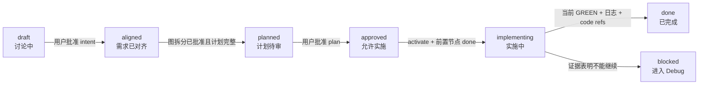

# Codex Companion

Codex Companion 是一个可安装到 Codex 的严格 Idea Graph harness。它把项目中的每个“想法”
保存为可审核的节点，让讨论、调研、计划、测试、实现、调试、代码引用和历史记录始终连接在
同一张依赖图上。

它不是单独一段 prompt，也不只是一个 skill：

- **Skill** 告诉 agent 何时进入 Onboard、Discuss、Plan、Build、Debug、Graph 或 Record。
- **Python runtime** 保存节点、审批凭证、测试证据、变更序号、覆盖率和日志。
- **Codex hooks** 在工具调用前后及停止时执行硬门禁，防止普通 agent 跳过流程。
- **HTML report** 展示完整项目图；点击节点后可查看八项 idea contract、前置节点和后继节点。

Codex Companion 与本仓库原有 AI Dev Companion ECL、`cc*` skills 和 Claude Code 版本完全
隔离。它只在目标项目中创建 `.codex-companion/`，不会创建或修改 `.claude/`、
`.devcompanion/`。

如果这个名字已经被其他工具占用，Codex Companion 不会覆盖它，而会把自己的整个状态
目录写入 `.codex-companion.codex/`。同样，显式渲染到一个已存在、且不是 Codex 生成的
HTML 文件时，会把 `report.html` 改为 `report.codex.html`。后续运行会继续使用同一个
Codex 后缀文件。Claude 和 Cursor 版本分别使用 `.claude`、`.cursor` 后缀；三者互不覆盖。
如果普通名称和 Codex 后缀名称都已被其他内容占用，命令会停止并报错，不会继续制造
`codex-2` 之类的名字。以下教程为简洁仍写 `.codex-companion/`；发生冲突时，将它替换为
CLI 输出的 `.codex-companion.codex/` 即可。

## 目录

- [一、先理解它如何工作](#一先理解它如何工作)
- [二、安装到 Codex](#二安装到-codex)
- [三、五分钟快速开始](#三五分钟快速开始)
- [四、完整教程：从想法到完成节点](#四完整教程从想法到完成节点)
- [五、Onboarding 一个已有项目](#五onboarding-一个已有项目)
- [六、Debugging 工作流](#六debugging-工作流)
- [七、查看图、状态和历史](#七查看图状态和历史)
- [八、CLI 命令速查](#八cli-命令速查)
- [九、状态文件说明](#九状态文件说明)
- [十、常见拦截与解决方法](#十常见拦截与解决方法)
- [十一、严格模式的边界](#十一严格模式的边界)
- [十二、开发和验证 Codex Companion](#十二开发和验证-codex-companion)

## 一、先理解它如何工作

每个 idea node 都是一个小型、可执行的合同，包含：

1. 这个想法是什么；
2. 为什么有这个想法；
3. 预期结果是什么；
4. 如何实现；
5. 为什么这样实现；
6. 实现代码位于哪些文件和行；
7. 如何验证结果；
8. 未来可以如何使用。

节点只保存 `depends_on`。如果 B 依赖 A，图中就是 `A → B`；后继关系由 renderer 自动
推导，避免两份边数据不一致。



正常情况下，你只需在 Codex 对话中表达目标，让 agent 调用 runtime。只有在批准点，
Codex Companion 才会要求你回复一个精确的一次性 challenge，例如：

```text
APPROVE CC-7A13F29C
```

不要加解释、Markdown 或代码围栏。拒绝时回复：

```text
REJECT CC-7A13F29C
```

challenge 与你看到的内容摘要绑定。审批后如果节点计划、测试定义、目标路径或图结构发生
变化，旧 receipt 自动失效，agent 必须重新让你审核。

## 二、安装到 Codex

### 2.1 前置条件

- ChatGPT desktop app 中的 Codex，或 Codex CLI；Codex IDE extension 当前不支持插件。
- Python 3.10 或更高版本；runtime 只使用 Python 标准库。
- 本目录的完整副本，尤其是 `.codex-plugin/plugin.json`、`skills/`、`hooks/` 和
  `scripts/companion.py`。

OpenAI 官方的 [Plugins 文档](https://developers.openai.com/codex/plugins)说明：插件安装后要
新开一个 chat/session 才能使用其 skills 和工具；plugin hooks 在启用前必须 review 和
trust。插件目录也可以通过 Codex CLI 的 `/plugins` 打开。

### 2.2 把本地目录加入个人 marketplace

在一个新的 Codex task 中调用内置 Plugin Creator：

```text
@plugin-creator 请把 D:\GitHub\ai-companion\codex-companion
加入我的 personal marketplace，供本地测试和安装。不要复制或修改 claude-companion。
```

如果目录位于别处，替换为实际绝对路径。官方的
[Package your plugin](https://developers.openai.com/plugins/build/plugins) 文档说明，
`@plugin-creator` 可以把已有 plugin folder 接到本地 marketplace；本目录已经包含必需的
`.codex-plugin/plugin.json`，不需要重新生成实现文件。

### 2.3 安装并启用

ChatGPT desktop app：

1. 打开 **Plugins**。
2. 进入 **Personal → Created by me**。
3. 打开 **Codex Companion**，点击加号安装。
4. 新建一个 Codex task。
5. 输入 `/hooks`，检查并 trust Codex Companion 的四类 hooks：
   `UserPromptSubmit`、`PreToolUse`、`PostToolUse`、`Stop`。

Codex CLI：

1. 启动 `codex`。
2. 输入 `/plugins`。
3. 在 personal marketplace 中安装并启用 **Codex Companion**。
4. 退出并启动一个新 session。
5. 审核并 trust plugin-bundled hooks。

官方 [Hooks 文档](https://developers.openai.com/codex/hooks)说明，plugin 可以从默认的
`hooks/hooks.json` 加载生命周期 hooks，但非托管 command hooks 必须经过用户信任才会运行。

### 2.4 确认安装成功

新建 task 后可以明确调用：

```text
@Codex Companion 显示当前项目的 Idea Graph 状态；如果还没初始化，只告诉我下一步，
暂时不要创建文件。
```

也可以直接描述目标；skill 的触发词包括 `Codex Companion`、`Idea Graph`、onboarding、
idea node、模块化项目理解，以及追踪“为什么有这段代码、如何验证”。

> 只运行 `scripts/companion.py` 而不安装或信任 hooks，仍可使用节点、CLI 和 HTML，
> 但写入门禁与 Stop 门禁不会生效，不能称为严格 harness 模式。

## 三、五分钟快速开始

以下示例使用 PowerShell。先设置两个变量：

```powershell
$Companion = "D:\GitHub\ai-companion\codex-companion\scripts\companion.py"
$Project = "D:\Projects\my-project"
```

macOS/Linux 可以使用：

```bash
COMPANION="/absolute/path/to/codex-companion/scripts/companion.py"
PROJECT="/absolute/path/to/my-project"
```

初始化目标项目：

```powershell
python $Companion init --root $Project --name "My Project"
```

创建第一个空节点：

```powershell
python $Companion new first-idea --name "First idea" --root $Project
```

查看和渲染：

```powershell
python $Companion status --root $Project --verbose
python $Companion validate --root $Project
python $Companion render --root $Project
```

生成的页面位于：

```text
<project>/.codex-companion/reports/idea-graph.html
```

如果初始化时发生名称冲突，把上面的状态目录替换成 CLI 返回的
`.codex-companion.codex/`。如果显式指定的 HTML 输出文件冲突，CLI 会直接打印实际采用的
`*.codex.html` 路径。

空节点处于 `draft`，可以通过 schema 校验，但不能进入 `aligned`、`planned` 或后续状态，
直到对应字段完整并得到真实用户批准。

## 四、完整教程：从想法到完成节点

下面用一个小型 Python 功能演示完整生命周期：实现 `greet(name)`，之后再由 CLI 调用它。
计划图为：

```text
greeting-core ──→ greeting-cli
```

教程完整执行 `greeting-core`。`greeting-cli` 按相同步骤执行，并且只有在
`greeting-core=done` 后才能进入 `implementing`。

### 4.1 初始化项目

在目标项目中使用 Codex Companion：

```text
@Codex Companion 初始化这个项目，然后和我讨论一个 greeting 功能。先不要设计实现。
```

对应的手动命令是：

```powershell
python $Companion init --root $Project --name "Greeting Demo"
```

初始化会在未占用时创建严格模式的 `.codex-companion/project.json`；如果普通状态目录属于
其他工具，则创建 `.codex-companion.codex/project.json`。同一份 Codex 状态重复执行 `init`
会失败，这是为了避免覆盖已有状态。

### 4.2 Discuss：只对齐三个高层问题

agent 应先确认：

1. 要做什么？
2. 什么可观察结果表示成功？
3. 为什么现在要做？

示例答案：

- **What**：提供一个可复用的 `greet(name)` Python 函数。
- **Expected result**：输入 `Ada` 时精确返回 `Hello, Ada!`。
- **Why**：后续 CLI 和 API 都要复用同一个 greeting 规则。

创建两个节点：

```powershell
python $Companion new greeting-core --name "Reusable greeting core" --root $Project
python $Companion new greeting-cli --name "Greeting CLI" --root $Project
```

agent 通过 `apply_patch` 填写两个节点的 `what`、`why`、`expected_result`，并设置：

```json
"depends_on": ["greeting-core"]
```

这行应出现在 `greeting-cli.json` 中；`greeting-core.depends_on` 保持空数组。

请求 intent 审批：

```powershell
python $Companion request-approval --gate intent `
  --node greeting-core --node greeting-cli --root $Project
```

runtime 会输出一次性 challenge。agent 必须停止，等你在真实 Codex prompt 中精确回复：

```text
APPROVE CC-XXXXXXXX
```

批准后两个节点从 `draft` 变为 `aligned`。下面这种做法会被拒绝：

```powershell
python $Companion set-status greeting-core aligned --root $Project
```

原因是 agent 不能通过普通状态命令替用户批准。

### 4.3 Plan Gate A：审核拆分图

先验证图没有未知依赖或环：

```powershell
python $Companion validate --root $Project
python $Companion render --root $Project
```

让 agent 只展示名称和边，暂时不要写详细实现计划。确认边界合理后，为**当前图中的每个
节点**请求 decomposition 审批：

```powershell
python $Companion request-approval --gate decomposition `
  --node greeting-core --node greeting-cli --root $Project
```

回复新的 `APPROVE CC-XXXXXXXX`。如果漏掉任一当前节点，runtime 会拒绝创建审批请求。
批准与节点名称及 `depends_on` 绑定；之后改变拆分或边，就必须重新审批。

### 4.4 Plan Gate B：调研并填写详细计划

详细计划必须先做本地调研，再做联网调研，并明确复用决策。对 `greeting-core`，一个完整
节点大致如下。时间字段由 `new` 命令生成，不要手工改 `id`、`status`、`created_at` 或
`schema_version`。

```json
{
  "schema_version": "idea-node/v1",
  "id": "greeting-core",
  "name": "Reusable greeting core",
  "status": "aligned",
  "what": "Provide one reusable Python greeting function.",
  "why": "CLI and later API nodes need one greeting rule.",
  "expected_result": "greet('Ada') returns exactly 'Hello, Ada!'.",
  "implementation": {
    "how": "Add greet(name) in src/greeting.py with a direct formatted return value.",
    "why_this_way": "A pure function is the smallest reusable boundary and needs no dependency.",
    "target_paths": ["src/greeting.py"],
    "research": {
      "local_findings": [
        "No existing greeting implementation; current Python modules live under src/."
      ],
      "external_findings": [
        "https://docs.python.org/3/tutorial/inputoutput.html documents Python formatted string literals."
      ],
      "reuse_decision": "Reuse Python f-strings and unittest; add no third-party dependency."
    },
    "weekly_plan": [
      {"week": 1, "outcome": "A failing behavior test and verified reusable greeting function."}
    ]
  },
  "code_refs": [],
  "verification": [
    {
      "id": "greet-behavior",
      "kind": "automated",
      "plan": "Calling greet('Ada') returns exactly 'Hello, Ada!'.",
      "command": ["python", "tests/test_greeting.py"],
      "test_paths": ["tests/test_greeting.py"],
      "status": "pending",
      "evidence": []
    }
  ],
  "future_use": "The CLI and future API nodes can import greet without duplicating formatting.",
  "depends_on": [],
  "inputs": ["name: non-empty display name"],
  "outputs": ["Greeting string in the form Hello, <name>!"],
  "created_at": "<保留 CLI 生成值>",
  "updated_at": "<保留或更新为当前 UTC 时间>"
}
```

其中：

- `target_paths` 是此节点允许修改的产品文件范围。
- `test_paths` 是 RED 阶段可以先创建或修改的测试范围。
- `command` 使用 argv 数组最清晰；runtime 使用 `shell=False` 执行，不支持 shell pipe、
  `&&` 或重定向。
- `code_refs` 现在必须为空，因为代码尚未实现。

填写完成后：

```powershell
python $Companion set-status greeting-core planned --root $Project
python $Companion validate --root $Project
python $Companion render --root $Project
python $Companion request-approval --gate plan --node greeting-core --root $Project
```

检查 HTML 详情中的八个部分、研究来源、路径范围、验证设计和周计划，再回复新的：

```text
APPROVE CC-XXXXXXXX
```

prompt hook 会把未变化的节点从 `planned` 变为 `approved`。agent 不能直接执行
`set-status ... approved`。

### 4.5 Build：激活一个拓扑就绪节点

先查看哪些节点可执行：

```powershell
python $Companion status --root $Project --verbose
```

激活 `greeting-core`，再进入实施状态：

```powershell
python $Companion activate greeting-core --root $Project
python $Companion set-status greeting-core implementing --root $Project
```

严格模式同时只允许一个 active node。节点必须已经 `approved`，plan receipt 必须仍然有效，
且所有 `depends_on` 节点必须为 `done`。

### 4.6 Test first：先创建测试并取得 RED 证据

让 Codex 先通过 `apply_patch` 创建 `tests/test_greeting.py`：

```python
import unittest
import sys
from pathlib import Path

sys.path.insert(0, str(Path(__file__).resolve().parents[1]))

from src.greeting import greet


class GreetingTest(unittest.TestCase):
    def test_named_greeting(self) -> None:
        self.assertEqual("Hello, Ada!", greet("Ada"))


if __name__ == "__main__":
    unittest.main()
```

此时 `src/greeting.py` 还不存在，测试应该失败。运行受控 RED：

```powershell
python $Companion run-check greeting-core greet-behavior `
  --phase red --root $Project
```

期望输出类似：

```text
red greeting-core/greet-behavior: failed_as_expected (exit 1)
```

runtime 会保存退出码和测试文件 SHA-256。RED 后修改测试会使证据过期，必须重新运行 RED。

如果测试意外通过，先判断已有实现是否已经满足节点、或者测试是否太弱。只有测试确实有效且
无需先看到失败时，才请求用户 waiver：

```powershell
python $Companion request-approval --gate red-waiver `
  --node greeting-core --check greet-behavior --root $Project
```

manual-only 节点没有自动测试，使用不带 `--check` 的 node-level `red-waiver`。

### 4.7 实现产品代码

取得有效 RED 后，让 Codex 创建 `src/greeting.py`：

```python
def greet(name: str) -> str:
    return f"Hello, {name}!"
```

PreToolUse hook 会检查：

- 当前节点是否 active 且为 `implementing`；
- plan receipt 是否仍然有效；
- 文件是否匹配 `implementation.target_paths`；
- 所有自动验证是否已有当前 RED 或用户 waiver。

如果实现途中发现还要修改 `src/config.py`，不要绕过门禁。先把该路径加入计划、重新进入
`planned` 并取得新的 plan approval，再继续。

### 4.8 运行 GREEN

```powershell
python $Companion run-check greeting-core greet-behavior `
  --phase green --root $Project
```

期望输出：

```text
green greeting-core/greet-behavior: passed (exit 0)
```

GREEN 证据绑定测试哈希和 active node 的 `change_seq`。之后任何被 hook 观察到的产品或测试
写入都会使 GREEN 过期；完成节点前需要重新运行。

如果节点还包含人工验证项，例如：

```json
{
  "id": "human-copy-review",
  "kind": "manual",
  "plan": "User confirms the displayed copy is correct.",
  "command": "",
  "test_paths": [],
  "status": "pending",
  "evidence": []
}
```

让用户实际观察结果后运行：

```powershell
python $Companion request-approval --gate manual-check `
  --node greeting-core --check human-copy-review --root $Project
```

用户回复 challenge 后，runtime 才会把该 manual check 标记为 passed 并保存 evidence。

### 4.9 补充精确代码引用和语义日志

格式化和最终修改完成后，把真实行号写入节点：

```json
"code_refs": [
  {
    "path": "src/greeting.py",
    "start_line": 1,
    "end_line": 2,
    "symbol": "greet",
    "role": "Implements the approved greeting output."
  }
]
```

行号是一基、包含首尾的范围。`done` 状态会验证文件存在且 `end_line` 没有超过文件长度。

然后记录“改了什么以及为什么”：

```powershell
python $Companion record `
  --kind implementation.completed `
  --summary "Added the reusable greeting core after RED and verified it GREEN." `
  --node greeting-core `
  --file src/greeting.py `
  --file tests/test_greeting.py `
  --details "Pure function is reused by the later CLI node." `
  --root $Project
```

带 `--node` 的 semantic record 会把 `recorded_seq` 更新到当前 `change_seq`。如果 GREEN 后又有
代码写入，应该先重新 GREEN，再重新 record。

### 4.10 完成、渲染并解除激活

严格顺序是：

```powershell
python $Companion set-status greeting-core done --root $Project
python $Companion validate --root $Project
python $Companion render --root $Project
python $Companion deactivate --root $Project
```

`done` 会检查：

- 当前 plan approval 未过期；
- 每个自动 check 都有最新 GREEN；
- 每个人工 check 已由用户批准；
- 测试文件哈希未变化；
- semantic record 与最新 tracked write 对齐；
- `code_refs` 存在且行号有效。

`done` 会改变图的状态，所以必须在之后重新 render。严格模式只有在图已刷新后才允许
deactivate。现在可以按拓扑顺序计划和实现 `greeting-cli`。

## 五、Onboarding 一个已有项目

Onboarding 的目标是先建立可审计的阅读覆盖，再从现有职责和设计决策中提炼 Idea Graph。

### 5.1 让 agent 开始 Onboarding

```text
@Codex Companion onboarding 这个项目。读取 coverage 中的每个文本文件、文档、代码行和
注释；不要把 vendor、generated 或 binary 假装成已读。先生成并展示 name-only graph，
等我审核后再继续。
```

### 5.2 扫描项目

```powershell
python $Companion init --root $Project --name "Existing Project"
python $Companion scan --root $Project
```

`scan` 优先使用 Git tracked + unignored files；若不是 Git 项目，则使用排除常见依赖/构建
目录的 filesystem fallback。结果写入 `.codex-companion/coverage.json`：

- `included`：文本路径、字节数、行数、SHA-256、`reviewed_at`；
- `skipped`：binary、无法读取文件及原因；
- `scope`：这次覆盖率清单来自 Git 还是 fallback。

### 5.3 分批阅读并标记

agent 每完整阅读一批未变化文件后运行：

```powershell
python $Companion reviewed README.md pyproject.toml src/app.py tests/test_app.py `
  --root $Project
```

再次运行 `scan` 时，如果文件内容哈希不变，会保留 `reviewed_at`；内容发生变化的文件会重新
变为未读。查看剩余数量：

```powershell
python $Companion status --root $Project
```

不要在 `coverage.json` 仍有未读文本文件时声称“完整读取了整个项目”。需要排除的范围必须
明确告诉用户原因。

### 5.4 从代码提炼节点

节点边界应对应“可观察责任或设计决策”，而不是机械地每个函数一个节点。例如：

- 请求鉴权；
- 配置加载；
- 缓存失效策略；
- 报告渲染；
- CLI 命令路由。

为现有代码填入精确 `code_refs` 和现有测试设计，但不要因为“看起来能工作”就直接伪造
`passed`。先生成 name-only graph 供用户审核；若要把历史节点认定为 `done`，仍应经过当前
approval 和 verification 流程。

最后运行：

```powershell
python $Companion validate --root $Project
python $Companion render --root $Project
```

## 六、Debugging 工作流

实现或 GREEN 失败后，先把问题分成两类。

### 6.1 实现偏离节点合同

对照节点八项内容、输入输出、测试和 `code_refs`，列出所有不一致：

```text
src/greeting.py:1-2
Expected: greet('Ada') returns 'Hello, Ada!'
Actual: returns 'Hi Ada'
Proposed correction: restore the approved punctuation and wording.
```

让用户审核完整 discrepancy list 后，再修改实现并重新运行 GREEN。记录诊断：

```powershell
python $Companion record `
  --kind debug.implementation_drift `
  --summary "Greeting implementation differed from the approved output." `
  --node greeting-core --file src/greeting.py --root $Project
```

### 6.2 实现与合同一致，但合同本身不对

不要猜测性修改代码。向用户展示：

- 实际输入；
- 实际输出；
- 节点 `what`、`why`、`expected_result`；
- 现有实现理由；
- 验证方案的局限。

用户修改 idea contract 后，原 plan receipt 会自动失效。将节点回到合适的 Discuss/Plan
状态，重新审核，而不是继续使用旧批准。

### 6.3 暂时无法继续

可把 `implementing` 节点设置为 `blocked`：

```powershell
python $Companion set-status greeting-core blocked --root $Project
python $Companion record `
  --kind debug.blocked `
  --summary "Blocked because the upstream API contract is unavailable." `
  --node greeting-core --root $Project
```

`blocked` 是有证据的状态，不是为了绕过 Stop hook。问题解决后，如果计划未变，可以回到
`implementing`；如果合同或计划改变，则必须重新取得 plan approval。

## 七、查看图、状态和历史

### 7.1 拓扑状态

```powershell
python $Companion status --root $Project --verbose
```

输出包含每个节点状态、prerequisites、dependents 和 `READY` 标记。`READY` 表示节点已经
approved/implementing，且所有 prerequisites 都为 done。

### 7.2 HTML Idea Graph

```powershell
python $Companion validate --root $Project
python $Companion render --root $Project
```

打开：

```text
<project>/.codex-companion/reports/idea-graph.html
```

首页只显示节点名称和有向边。点击节点后可以查看：

- 八项 idea contract；
- 当前状态；
- prerequisites；
- 此节点是哪些节点的 prerequisite；
- 本地和外部调研；
- approved target paths；
- verification command、test paths、状态和 evidence；
- 精确代码引用。

HTML 是 self-contained review surface，不是状态源；canonical source 是 nodes JSON。

### 7.3 Audit log

`.codex-companion/log.ndjson` 是 append-only NDJSON，每行一个 JSON event。它同时包含：

- 项目初始化、节点创建和状态变化；
- approval requested/approved/rejected；
- hook 观察到的 idea/code file changes；
- RED/GREEN 结果；
- onboarding scan/review；
- agent 添加的 semantic records；
- render 事件。

不要重写旧事件来让历史看起来成功。新的修正和失败应追加为新事件。

## 八、CLI 命令速查

所有命令都支持 `--root <target-project>`。如果从目标项目的子目录运行，runtime 也会向上
寻找最近的 `.codex-companion/project.json`。

| 命令 | 用途 |
| --- | --- |
| `init [--name NAME]` | 初始化严格模式状态目录 |
| `new ID --name NAME` | 创建一个 `draft` 空节点 |
| `scan` | 生成或刷新 onboarding coverage |
| `reviewed PATH...` | 标记已完整阅读且哈希未变的文件 |
| `status [--verbose]` | 查看拓扑状态、ready 节点和未读文件数 |
| `validate` | 校验 schema、字段、代码引用和 DAG |
| `render [--output PATH]` | 生成 self-contained HTML；严格模式只允许 reports 目录 |
| `request-approval --gate GATE --node ID...` | 创建一次性、内容绑定的用户审批 challenge |
| `activate ID` | 激活一个 approved 且拓扑就绪的节点 |
| `set-status ID STATUS` | 执行允许的生命周期转换；不能直接设 aligned/approved |
| `run-check ID CHECK --phase red\|green` | 执行 shell-free 自动验证并保存证据 |
| `record --kind K --summary S [--node ID]` | 追加语义日志，并同步该节点 recorded sequence |
| `deactivate` | 清除已 done/blocked/superseded 的 active node |

Approval gates：

| Gate | 绑定内容 | 批准后的效果 |
| --- | --- | --- |
| `intent` | `id/name/what/why/expected_result` | `draft → aligned` |
| `decomposition` | 全图节点名称和 `depends_on` | 允许 aligned 节点进入 planned |
| `plan` | 计划、研究、路径、验证、输入输出和依赖 | `planned → approved` |
| `red-waiver` | 当前计划及可选 check | 允许没有 expected RED 的产品写入 |
| `manual-check` | 一个节点的一个 manual verification | 将人工检查标为 passed 并保存用户 evidence |

查看任一命令的完整参数：

```powershell
python $Companion request-approval --help
python $Companion run-check --help
```

`hook` 是 plugin lifecycle 的内部入口，不要手工调用，也不要让 agent 用它模拟用户 prompt。

## 九、状态文件说明

初始化后的结构如下。这里用 `<state>/` 表示 CLI 选中的 `.codex-companion/` 或冲突时的
`.codex-companion.codex/`：

```text
<state>/
├── project.json                 # 项目设置和 strict enforcement 开关
├── nodes/
│   └── <id>.json                # 每个想法的 canonical contract
├── pending/
│   └── <challenge>.json         # 尚未回答的一次性审批请求
├── approvals/
│   └── <challenge>.json         # 用户响应、session/turn 和内容摘要
├── runtime/
│   ├── <id>.json                # change_seq、recorded_seq、RED/GREEN evidence
│   └── project.json             # 最近一次 render 的 graph digest
├── reports/
│   └── idea-graph.html          # 可点击、自包含的项目图
├── coverage.json                # onboarding 文件覆盖率
├── active.json                  # 当前唯一 active node；无 active 时不存在
└── log.ndjson                   # append-only audit log
```

不要直接修改以下 runtime-managed 内容：

- 节点的 `schema_version`、`id`、`status`、`created_at`；
- `active.json`；
- `pending/`、`approvals/`、`runtime/`；
- `coverage.json`、`log.ndjson`、生成的 reports。

节点的计划字段可以在 Discuss/Plan 时通过 `apply_patch` 修改；一旦修改了已批准内容，相关
receipt 自然失效。

## 十、常见拦截与解决方法

### `No Codex Companion project found`

目标项目尚未初始化，或 `--root` 指错：

```powershell
python $Companion init --root $Project
```

### `Direct aligned/approved transitions are forbidden`

不能由 agent 自我批准。使用对应 `request-approval`，然后由用户在真实 prompt 中回复
challenge。

### `Decomposition approval must include every graph node`

重复 `--node`，列出 `.codex-companion/nodes/` 中所有当前节点。先运行 `status --verbose`
检查完整清单。

### `Approval request is stale because its reviewed content changed`

用户看到内容之后，节点或图发生变化。重新 render/展示变化，再创建新的 approval request。

### `Strict mode activates only approved nodes`

先完成 decomposition、planned 状态和 plan approval。不能直接从 draft/aligned 开始写产品
代码。

### `product edit blocked: run red phase for ...`

先在声明的 `test_paths` 中实现测试，再执行：

```powershell
python $Companion run-check <node> <check> --phase red --root $Project
```

### `red evidence ... is stale`

RED 之后测试文件变化。确认测试仍表达同一预期，再重新执行 RED。

### `path is outside approved target_paths and test_paths`

不要临时扩大实现。把新路径及理由加入计划，重新计划并让用户批准。

### `green verification stale`

GREEN 后有新的 tracked write。重新执行 GREEN；如果行为改变，先进入 Debug。

### `semantic record is stale`

最后一次代码/测试变更尚未有语义记录。完成验证后执行带 `--node` 的 `record`。

### `Render the current graph before deactivating a done node`

`done` 改变了图状态。先 `validate`、`render`，再 `deactivate`。

### agent 无法执行普通 Python/npm/shell mutation

严格 PreToolUse 会阻止常见 shell 写入和脚本解释器绕过。自动验证应写入 node 的
`verification.command` 并通过 `run-check` 执行；文件编辑应使用受 hook 检查的
`apply_patch`。如果计划确实需要安装依赖，把依赖和路径纳入计划并让用户重新审核；当前
严格 runtime 不提供一个通用的“任意 shell 写入”后门。

### 插件安装了但没有触发

确认：

1. 已经安装并 enabled；
2. 安装后新开了 task/session；
3. 使用 `@Codex Companion` 明确调用一次；
4. `/hooks` 中四类 hooks 都已 trust；
5. 当前目录位于目标项目内。

## 十一、严格模式的边界

新项目默认配置：

```json
"enforcement": {
  "mode": "strict",
  "test_first": true,
  "scope_paths": true,
  "stop_checks": true
}
```

runtime 可以客观证明：

- 状态是否通过允许的转换；
- 用户批准的是哪个内容摘要；
- agent 使用受支持编辑工具时是否越界；
- RED/GREEN 的命令退出码和测试哈希；
- GREEN 是否发生在最新 tracked write 之后；
- semantic log 是否覆盖最新变更；
- code references 是否指向存在的有效行范围；
- HTML 是否对应当前图摘要。

它不能客观证明：

- prose 是否真正有洞察；
- 调研是否穷尽了所有方案；
- agent 是否真正理解了读过的每一行；
- 人工观察是否诚实；
- 未触发 Codex hooks 的外部程序是否写过文件。

Hooks 是 behavioral guardrail，不是恶意进程的安全沙箱。用户可以禁用 hooks，其他外部
editor、进程或不受 matcher 覆盖的工具也可能不产生事件。因此：

- 安装后必须 review/trust hooks；
- 团队项目仍应使用 Git review、分支保护和 CI；
- 不要把 `.codex-companion` approval receipts 当作密码学签名；
- 对高风险项目，把 runtime evidence 作为审核材料，而不是唯一安全边界。

## 十二、开发和验证 Codex Companion

在包含 `codex-companion/` 的父仓库根目录运行：

```powershell
python -B -m unittest discover -s codex-companion\tests -v
python -B codex-companion\scripts\companion.py validate `
  --root codex-companion\examples\demo
python -B codex-companion\scripts\companion.py render `
  --root codex-companion\examples\demo
```

测试覆盖 approval freshness、生命周期、DAG、RED/GREEN、path scope、protected state、
semantic record、Stop behavior、onboarding coverage 和 HTML 内容。

示例页面：

```text
codex-companion/examples/demo/.codex-companion/reports/idea-graph.html
```

发布或重新安装修改后的本地版本前，更新 `.codex-plugin/plugin.json` 的版本，并用
Plugin Creator 的 validation/cache-buster/reinstall 流程刷新 personal marketplace。
