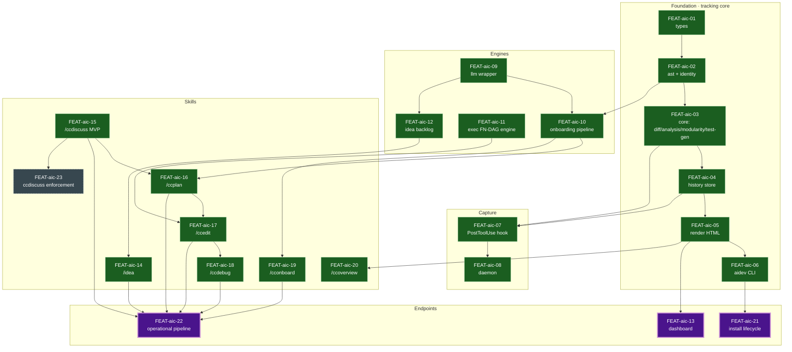
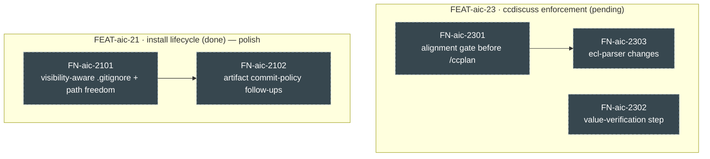

# ai-companion — Feature/Task Dependency DAG

Human-readable render of [`ai-companion.ecl.yaml`](./ai-companion.ecl.yaml), the
canonical two-level map of this repo in AI Dev Companion ECL form. Recipe:
[`README.md`](./README.md).

> **Keep in sync:** the Mermaid edges below are hand-authored to match the YAML's
> `dependency_graph` exactly. If you change one, change the other (no generator by design).

## How to read this

- **Nodes** are milestones (`FEAT-aic-*`) / tasks (`FN-aic-*`). Each is documented with the
  AI Companion **5 questions** — `what` (是什么) · `why` (为什么做) · `how` (如何做) ·
  `why_this_way` (为什么这样做) · `expected` (期望结果). The full record for every node is
  in the [**Milestone records**](#milestone-records-5-questions) section below.
- **Edges** are **prerequisites** — `A --> B` means B can't start until A is done.
- The graph flows from **foundations** (types, llm, exec, ccdiscuss) to the three
  **terminal deliverables** (🟪): `FEAT-aic-22` operational pipeline · `FEAT-aic-13`
  dashboard · `FEAT-aic-21` installable distribution.
- **Click any node** to jump to its 5-question record. *(Node-clicks work in VS Code
  Markdown preview, Mermaid Live, and Obsidian. GitHub disables Mermaid clicks — use the
  [node index](#node-index) links there.)*
- Node color = status.

## The DAG

**Legend:** 🟩 done · ▦ pending (dashed) · 🟪 terminal (endpoint).

## Open frontier (task-level zoom)

Most milestones are done; the remaining from-scratch tasks hang off two milestones.

## Where you left off → next actions

**Summary.** The entire tracking core (`types→ast→core→history→render→cli`), the capture
path (`hook→daemon`), the engines (`llm`, `exec`, onboarding pipeline, `idea`), all **7
wired skills**, the **dashboard**, and the **install lifecycle** are done — commit
`d683ce4` landed llm/exec/idea/dashboard + install + skills wiring. All three endpoints are
reached as an MVP. **The open work is hardening, not new foundations.**

| Node | Status | Do next / gap |
|------|--------|----------------|
| [`FN-aic-2101`](#fn-aic-2101) | pending | Installer: visibility-aware `.gitignore` + path freedom (in idea backlog). **Start here.** |
| [`FN-aic-2301`](#fn-aic-2301) | pending | ccdiscuss alignment gate before `/ccplan` (make alignment enforceable). |
| [`FN-aic-2302`](#fn-aic-2302) | pending | ccdiscuss value-verification step (catch expected-result divergence). |
| [`FN-aic-2102`](#fn-aic-2102) | blocked | Artifact commit-policy follow-ups — needs `FN-aic-2101`. |
| [`FN-aic-2303`](#fn-aic-2303) | blocked | ecl-parser changes — needs `FN-aic-2301`. |
| [`FEAT-aic-23`](#feat-aic-23) | pending | Enforcement layer completes once `FN-aic-2301..2303` are done. |

> The deferral of `FEAT-aic-23` was deliberate: the advisory ccdiscuss MVP shipped first to
> validate the 5-question loop before paying for enforcement machinery.

## Node index

Click-through fallback (works everywhere, incl. GitHub):

**Milestones** —
[01 types](#feat-aic-01) ·
[02 ast](#feat-aic-02) ·
[03 core](#feat-aic-03) ·
[04 history](#feat-aic-04) ·
[05 render](#feat-aic-05) ·
[06 cli](#feat-aic-06) ·
[07 hook](#feat-aic-07) ·
[08 daemon](#feat-aic-08) ·
[09 llm](#feat-aic-09) ·
[10 onboarding](#feat-aic-10) ·
[11 exec](#feat-aic-11) ·
[12 idea](#feat-aic-12) ·
[13 dashboard ◆](#feat-aic-13) ·
[14 /idea](#feat-aic-14) ·
[15 /ccdiscuss](#feat-aic-15) ·
[16 /ccplan](#feat-aic-16) ·
[17 /ccedit](#feat-aic-17) ·
[18 /ccdebug](#feat-aic-18) ·
[19 /cconboard](#feat-aic-19) ·
[20 /ccoverview](#feat-aic-20) ·
[21 install ◆](#feat-aic-21) ·
[22 pipeline ◆](#feat-aic-22) ·
[23 enforcement](#feat-aic-23)

**Tasks** —
[2101](#fn-aic-2101) · [2102](#fn-aic-2102) · [2301](#fn-aic-2301) · [2302](#fn-aic-2302) · [2303](#fn-aic-2303)

---

## Milestone records (5 questions)

Each entry: **status** · 是什么 / 为什么做 / 如何做 / 为什么这样做 / 期望结果.

### FEAT-aic-01 · types — 🟩 done
- **是什么** — The shared interface vocabulary: analysis, modularity, history, ECL types.
- **为什么做** — Every other package speaks these types; without one contract they'd drift apart.
- **如何做** — `packages/types/src`, interface-only (no runtime): FunctionAnalysis, ProjectIndex, ChangeRecord, etc.
- **为什么这样做** — A zero-dependency types package at the graph root lets all packages share contracts without a cyclic import.
- **期望结果** — All packages import `@aidev/types` and typecheck against one source of truth.

### FEAT-aic-02 · ast + identity — 🟩 done
- **是什么** — Tree-sitter WASM parsers (Python + TS); function extraction + stable identity hashing.
- **为什么做** — Function-level tracking needs an identifier that survives line-number drift.
- **如何做** — `wasm-resolver.ts`, `parser-factory.ts`, `parser.ts`/`ts-parser.ts`, `multi-lang.ts` (`parseFileAuto`). Identity = `sha256(file+class+fn+param_types)[0:16]`.
- **为什么这样做** — Identity from structure (not line numbers) keeps history intact across edits; WASM parsers avoid native builds.
- **期望结果** — `parseFileAuto` extracts functions for `.py`/`.ts`; identical functions hash identically across line moves.

### FEAT-aic-03 · core — 🟩 done
- **是什么** — Diff parsing + change annotation + analysis (heuristic + LLM) + modularity metrics + test-gen.
- **为什么做** — The heart of the product: which functions changed, why, and what tests they need.
- **如何做** — `diff/` (unified-diff parse, git), `analysis/` (function-level, batch), `modularity/` (cohesion/coupling, contracts), `test-gen/` (Py + TS skeletons).
- **为什么这样做** — Subsystem folders keep diff/analysis/modularity/test-gen independently testable while sharing the ast layer.
- **期望结果** — A git diff resolves to annotated function-level changes + generated test skeletons.

### FEAT-aic-04 · history — 🟩 done
- **是什么** — Plain-JSON file store for `reviews/`, `history/`, `index.json`.
- **为什么做** — Track changes over time without a database dependency.
- **如何做** — `packages/history/src` — JSON files under `.devcompanion/`; `ProjectIndex` with `function_index`.
- **为什么这样做** — Plain JSON (no DB) keeps the companion drop-in for any repo and human-inspectable.
- **期望结果** — Change records persist and reload; `index.json` maps function hashes to history.

### FEAT-aic-05 · render — 🟩 done
- **是什么** — Renders annotated HTML reports: session view + onboard view.
- **为什么做** — Make tracked changes and onboarding analysis readable to humans.
- **如何做** — `renderSessionToHtml` (changes grouped by reason + inline diffs), `renderOnboardHtml` (modules/functions/overview).
- **为什么这样做** — Server-rendered static HTML needs no frontend build and opens anywhere.
- **期望结果** — A `ReviewSession`/`ProjectIndex` renders to a self-contained HTML file.

### FEAT-aic-06 · cli — 🟩 done
- **是什么** — Commander CLI `aidev`: init, review, render, history, onboard, analyze, idea.
- **为什么做** — Manual entry point for tracking and reports, independent of the hook.
- **如何做** — `aidev <command> -p <project>`; wraps core + history + render.
- **为什么这样做** — A CLI gives a user-driven trigger mode alongside the automatic hook, sharing the same core.
- **期望结果** — `aidev <command> -p <path>` runs each subcommand against a target project.

### FEAT-aic-07 · hook — 🟩 done
- **是什么** — Claude Code PostToolUse handler (<100ms) that records edits at function level.
- **为什么做** — Automatic capture: every AI edit becomes a tracked event with its reason, no manual step.
- **如何做** — `packages/hook/src` — records `.py`/`.ts` at function level, degrades `.yaml`/`.md` to file-level; queues to `.devcompanion/queue/events.jsonl`.
- **为什么这样做** — Degrade-don't-drop preserves a complete audit trail; <100ms keeps the editor responsive.
- **期望结果** — An edit to a `.py`/`.ts`/`.yaml`/`.md` file records exactly one event.

### FEAT-aic-08 · daemon — 🟩 done
- **是什么** — Background queue processor for async diff + storage.
- **为什么做** — Keep the hook fast by deferring heavy diff/analysis/storage off the critical path.
- **如何做** — `packages/daemon/src` — drains the events queue and runs the hook's processing asynchronously.
- **为什么这样做** — Splitting capture (hook) from processing (daemon) keeps the synchronous hook under its latency budget.
- **期望结果** — Queued events are processed into history without blocking edits.

### FEAT-aic-09 · llm — 🟩 done
- **是什么** — Thin wrapper around the Claude CLI: `callClaude`, `preflight`.
- **为什么做** — One place for LLM calls so analysis/onboarding/idea don't each reinvent it.
- **如何做** — `packages/llm/src` — standalone; spawns the Claude CLI and handles preflight checks.
- **为什么这样做** — Wrapping the CLI (not an SDK) reuses the user's existing Claude auth and stays dependency-light.
- **期望结果** — `callClaude` returns model output; `preflight` fails fast when the CLI is unavailable.

### FEAT-aic-10 · onboarding pipeline — 🟩 done
- **是什么** — project detection → AST scan → LLM function analysis → semantic ECL inference → test skeletons → overview HTML.
- **为什么做** — The engine behind `/cconboard` and `/ccplan` Phase 10: understand an existing codebase end-to-end.
- **如何做** — `run-onboarding.ts` → `onboarding-pipeline.ts`; `enhanced-analyzer.ts` (why/what/how per fn), `opus-ecl-generator.ts`, `ecl-inferrer.ts`. Output: `.devcompanion/analysis.json` + `docs/ecl/<project>-features.yaml`.
- **为什么这样做** — Opus→Haiku→Opus staging keeps per-function analysis cheap while bookending it with strong understanding/synthesis.
- **期望结果** — Running it on a repo emits `analysis.json` + a feature-level ECL + test skeletons.

### FEAT-aic-11 · exec — 🟩 done
- **是什么** — The engine behind `/ccedit`: parse an ECL FN-DAG, topo-sort, find ready nodes, run verification, write status.
- **为什么做** — Turn an approved plan (ECL) into parallel, dependency-ordered execution.
- **如何做** — `parseEclDag`, `validateFnFields`, `topologicalSort` (Kahn → `ExecutionLayer[]`), `getReadyNodes`, `runVerification`, `updateFnStatus`; CLI `parse|state|set-status|verify`. Win32 spawn fallback in `runVerification`.
- **为什么这样做** — Depends only on `yaml` so the executor is reusable standalone; topo layers expose independent nodes for parallel subagents.
- **期望结果** — An ECL with a `functions:` DAG parses, sorts into layers, and reports ready/blocked nodes.

### FEAT-aic-12 · idea — 🟩 done
- **是什么** — Idea backlog store + research runner behind `/idea`.
- **为什么做** — Capture ideas and trigger research without leaving the workflow.
- **如何做** — `packages/idea/src` — stores ideas at `.devcompanion/ideas/`; research runner uses `@aidev/llm`.
- **为什么这样做** — Backing `/idea` with a real package keeps idea storage/research testable rather than ad-hoc.
- **期望结果** — `/idea add|list|research|show` persists and retrieves ideas.

### FEAT-aic-13 · dashboard — 🟪 endpoint (done)
- **是什么** — Fastify web UI that scans projects and serves their reports.
- **为什么做** — A browsable home for all scanned projects, beyond per-repo HTML files.
- **如何做** — `packages/dashboard/src` — Fastify server; `npm run dashboard:start|stop|restart|status`. Code-standalone; consumes rendered reports.
- **为什么这样做** — A standalone web server decouples the UI lifecycle from the tracking core.
- **期望结果** — `dashboard:start` serves a UI listing scanned projects and their reports.

### FEAT-aic-14 · /idea — 🟩 done
- **是什么** — Slash command for the idea backlog (add|list|research|show).
- **为什么做** — Make the idea backlog reachable from Claude Code.
- **如何做** — Self-contained in `.claude/commands/idea.md` (no `skills/idea/` dir); calls `@aidev/idea`.
- **为什么这样做** — Fully self-contained because the behavior is small enough not to need a separate SKILL.md.
- **期望结果** — `/idea` subcommands work inside a Claude Code session.

### FEAT-aic-15 · /ccdiscuss MVP — 🟩 done
- **是什么** — Best-effort 6-step alignment loop BEFORE planning; human writes expected first, AI emits the 5 questions + flags divergence; outputs an aligned ECL.
- **为什么做** — Catch human↔AI divergence before any code is planned.
- **如何做** — `.claude/commands/ccdiscuss.md` + `skills/ccdiscuss/SKILL.md`; writes `docs/ecl/*.yaml`; read-if-present by `/ccplan` (no gate).
- **为什么这样做** — Framed as best-effort discipline (not an enforced gate) so it adds alignment without blocking; enforcement is deferred ([FEAT-aic-23](#feat-aic-23)).
- **期望结果** — Running `/ccdiscuss` produces an aligned ECL with the 5 questions + divergence flags.

### FEAT-aic-16 · /ccplan — 🟩 done
- **是什么** — Diverge-then-converge requirement engineering (12-phase spiral with a Phase-9 review gate); outputs an ECL.
- **为什么做** — Turn ambiguous/conflicting requirements into a validated, adversarially-checked plan.
- **如何做** — `.claude/commands/ccplan.md` + `skills/ccplan/SKILL.md` (+ `ecl-schema.md`); reads `/ccdiscuss` ECL if present; Phase 10 uses the onboarding pipeline.
- **为什么这样做** — An explicit STOP-for-approval gate at Phase 9 keeps it read-only until a human signs off.
- **期望结果** — Running `/ccplan` produces an approved ECL (REQ/FEAT/MOD/FN + dependency_graph).

### FEAT-aic-17 · /ccedit — 🟩 done
- **是什么** — DAG-driven executor for an approved ECL: topo-sort, fan out one subagent per independent FN, run verify, write status.
- **为什么做** — Execute the plan in dependency order with parallelism and automatic failure routing.
- **如何做** — `.claude/commands/ccedit.md` + `skills/ccedit/SKILL.md`; drives `@aidev/exec`; routes failures to `/ccdebug`.
- **为什么这样做** — Only the orchestrator writes status (atomic temp-file + rename); subagents never do — prevents race corruption.
- **期望结果** — Running `/ccedit` on an approved ECL executes ready nodes, verifies, and updates status.

### FEAT-aic-18 · /ccdebug — 🟩 done
- **是什么** — Failure → source function → change history → root cause → fix → record; fix-code-not-tests, max 3 retries, full regression.
- **为什么做** — Close the loop when a verification fails during execution.
- **如何做** — `.claude/commands/ccdebug.md` + `skills/ccdebug/SKILL.md`; consumes history to trace the failing function.
- **为什么这样做** — Enforcing fix-code-not-tests + retry cap stops the agent from "passing" by weakening tests or looping forever.
- **期望结果** — A failing verify is traced to a root cause and fixed without editing the test, or stops after 3 tries.

### FEAT-aic-19 · /cconboard — 🟩 done
- **是什么** — Onboard an existing codebase: scan, analyze, modularize, test, document; archive originals.
- **为什么做** — Bring a messy/unknown repo under the companion with a full audit trail.
- **如何做** — `.claude/commands/cconboard.md` + `skills/cconboard/SKILL.md` (+ `ol-schema.md`); drives the onboarding pipeline; archives to `archive/<timestamp>/`.
- **为什么这样做** — Archiving originals before restructuring makes every change reversible and auditable.
- **期望结果** — Running `/cconboard` yields modular, tested, documented code + an onboarding log + ECL with guards.

### FEAT-aic-20 · /ccoverview — 🟩 done
- **是什么** — Thin wrapper that generates the project's overview HTML (bilingual en+zh by default).
- **为什么做** — One command to (re)generate the human-facing project overview for the CURRENT repo.
- **如何做** — `.claude/commands/ccoverview.md` + `skills/ccoverview/SKILL.md`; wraps `scripts/generate-overview.ts`; `--skip-translation` emits a single `overview.html`.
- **为什么这样做** — A thin wrapper (never `--target`) keeps it scoped to the current project and avoids duplicating the script.
- **期望结果** — `/ccoverview` emits `overview-en.html` + `overview-zh.html` (or one `overview.html` with `--skip-translation`).

### FEAT-aic-21 · install lifecycle — 🟪 endpoint (done)
- **是什么** — Idempotent, registry-tracked installation of the companion into other repos.
- **为什么做** — Let other projects adopt the companion (skills + config + hook) without manual copying.
- **如何做** — `scripts/install.ts <target> [--enforce] [--no-commands]`; `update.ts`/`status.ts`/`uninstall.ts`; registry tracks installs. Installed into 5 sibling repos.
- **为什么这样做** — Idempotent + registry-tracked so re-running install is safe and updates are diffable per target.
- **期望结果** — `install` into a target wires skills/config/hook; status/update/uninstall manage it; re-install is a no-op.

### FEAT-aic-22 · operational pipeline — 🟪 endpoint (done)
- **是什么** — The full diverge→plan→execute→debug workflow (idea → ccdiscuss → ccplan → ccedit → ccdebug, + cconboard) wired and usable.
- **为什么做** — This repo is developed WITH its own pipeline — the pipeline being operational IS the primary deliverable.
- **如何做** — All 7 commands wired (`.claude/commands/*` + `skills/*/SKILL.md`); ECL YAML threads them together; landed in commit `d683ce4`.
- **为什么这样做** — Skills hand off via persistent ECL files (read-if-present), so the chain is composable rather than a monolith.
- **期望结果** — A change can flow idea→discuss→plan→edit→debug end-to-end using the slash commands.

### FEAT-aic-23 · ccdiscuss enforcement — ▦ pending (deferred)
- **是什么** — Turn ccdiscuss alignment from best-effort into an enforced gate: alignment gate + value-verification + ecl-parser changes.
- **为什么做** — MVP ccdiscuss is advisory; enforcement would make alignment a hard precondition for planning.
- **如何做** — Add a gate before `/ccplan` ([FN-aic-2301](#fn-aic-2301)), a value-verification step ([FN-aic-2302](#fn-aic-2302)), and parser changes ([FN-aic-2303](#fn-aic-2303)).
- **为什么这样做** — Deferred on purpose: shipping the advisory MVP first validated the 5-question loop before paying for enforcement machinery.
- **期望结果** — Alignment becomes a checkable precondition; `/ccplan` refuses/flags unaligned ECLs.

---

## Task records (5 questions)

### FN-aic-2101 · visibility-aware .gitignore + path freedom — ▦ pending  *(parent: FEAT-aic-21)*
- **是什么** — Installer manages `.gitignore` based on repo visibility and frees the install path.
- **为什么做** — Companion-generated files need different commit policies in public vs private repos (idea backlog).
- **如何做** — Extend `scripts/install.ts` to detect visibility and write the right `.gitignore` rules; relax hardcoded paths.
- **为什么这样做** — Visibility-aware rules prevent leaking private artifacts while still tracking what should be shared.
- **期望结果** — Install into a public vs private repo applies the correct `.gitignore` + path layout.

### FN-aic-2102 · artifact commit-policy follow-ups — ▦ blocked  *(parent: FEAT-aic-21; needs FN-aic-2101)*
- **是什么** — Finish the public/private artifact commit policy across installed repos.
- **为什么做** — TokenMonitor/ERB were patched ad-hoc; the policy should be installer-driven.
- **如何做** — Encode the commit policy in the installer so each target gets consistent artifact handling.
- **为什么这样做** — Centralizing in the installer stops per-repo drift in what gets committed.
- **期望结果** — All installed repos follow one consistent artifact commit policy.

### FN-aic-2301 · alignment gate before /ccplan — ▦ pending  *(parent: FEAT-aic-23)*
- **是什么** — A precondition that `/ccplan` checks an aligned ECL exists/passes before planning.
- **为什么做** — Make alignment enforceable rather than read-if-present.
- **如何做** — Add a gate hook in the ccplan entry that inspects the ccdiscuss ECL's alignment fields.
- **为什么这样做** — Gating at ccplan's boundary keeps ccdiscuss itself non-blocking while still enforcing alignment downstream.
- **期望结果** — `/ccplan` stops (or flags) when no aligned ECL is present.

### FN-aic-2302 · value-verification step — ▦ pending  *(parent: FEAT-aic-23)*
- **是什么** — Verify the human's expected-result value against the AI's understanding (soft-criteria sign-off).
- **为什么做** — Catch expected-result divergence, not just structural alignment.
- **如何做** — Add a value-verification pass comparing the Step-2 human expectation vs the node's `expected` field.
- **为什么这样做** — Soft (human-judged) criteria can't be auto-closed, so this records explicit sign-off.
- **期望结果** — Divergent expected-results are flagged and require sign-off.

### FN-aic-2303 · ecl-parser changes — ▦ blocked  *(parent: FEAT-aic-23; needs FN-aic-2301)*
- **是什么** — Parser support for the enforcement fields the gate/value-verification need.
- **为什么做** — The MVP deliberately did NOT modify `ecl-parser.ts`; enforcement needs it.
- **如何做** — Extend `scripts/lib/ecl-parser.ts` to read the alignment/value-verification fields.
- **为什么这样做** — Kept out of the MVP to avoid destabilizing the parser before the loop was proven.
- **期望结果** — Parser exposes alignment + value-verification fields to the gate.
